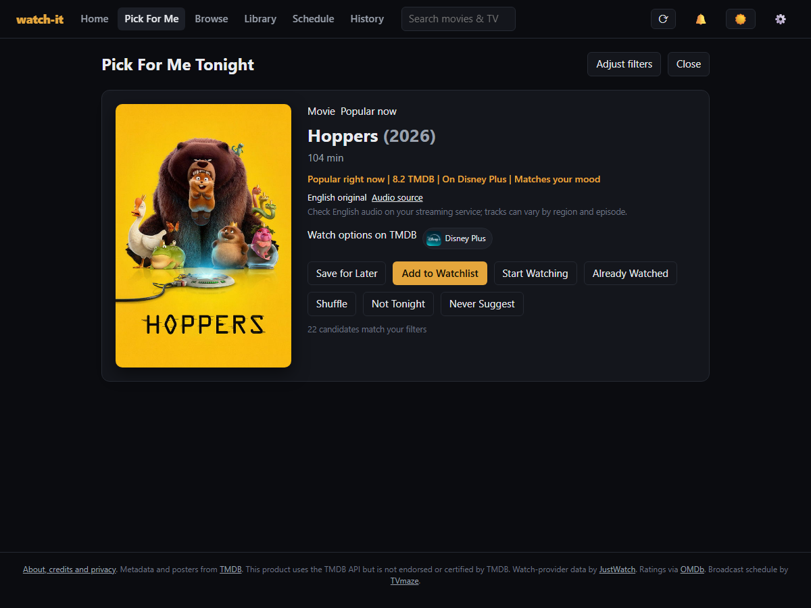
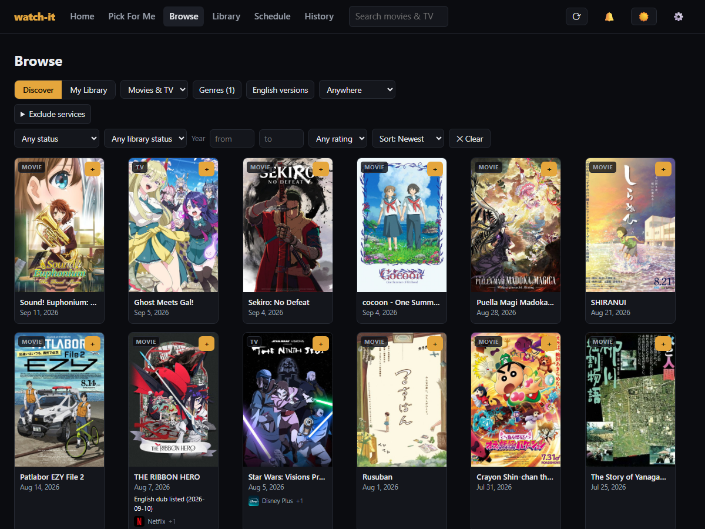
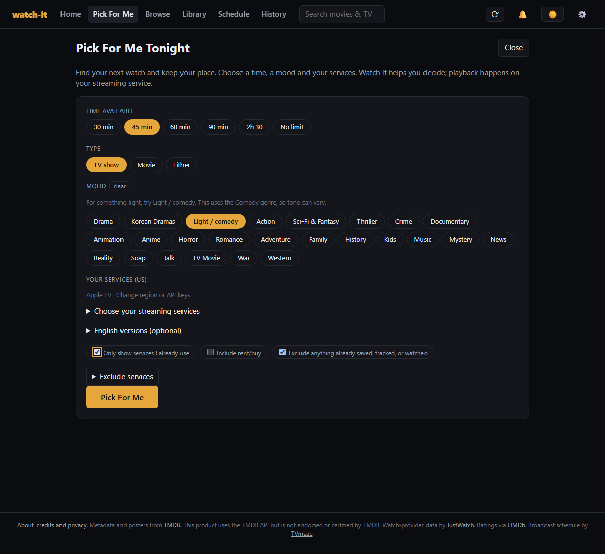
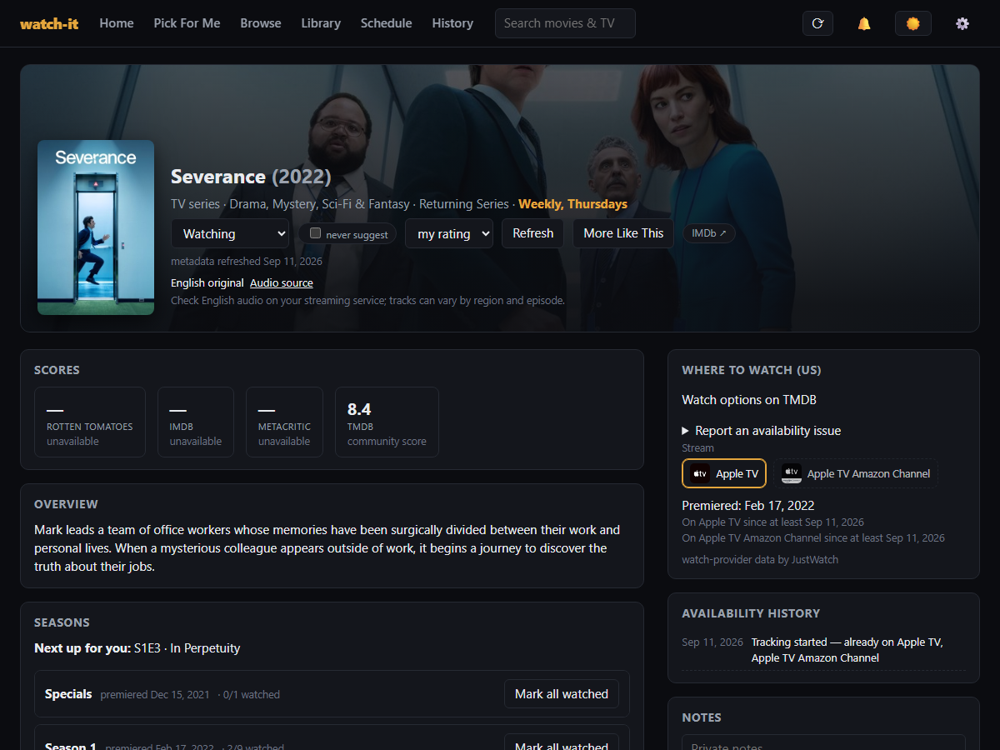

# watch-it

**Find your next watch and keep your place.**

Watch It is a self-hosted movie and TV discovery and watch-tracking app for people who watch across streaming subscriptions. Tell **Pick For Me** how much time you have, choose your services and a mood, then save a suggestion and manually mark episodes watched to keep your place.

**No video files needed.** Watch It does not host, play or download video. Watch options opens TMDB's regional provider listing; follow a service link there to watch with your own subscription. You never give Watch It your streaming-service passwords.

Run it on your computer or home server using Docker and your own TMDB API key, which you paste into **Settings > API keys**. OMDb ratings are optional. **Each installation has one shared library**, including progress and settings. The optional installation password protects access; it does not create separate accounts or private libraries.



[Get started](#get-started) · [Try a sample](#try-a-sample-before-installing) · [Take a look](#take-a-look) · [Installation help](docs/INSTALL.md) · [Backups and updates](docs/OPERATIONS.md)

## What you can do

- **Decide what to watch.** Pick For Me uses your available time, mood, genres, and services. Shuffle, save a suggestion, or choose never to see it again.
- **Browse across services.** Explore movies, TV, Korean dramas, and anime. Search all available sources or stick to your subscriptions, with exclusions for services you do not want.
- **Keep your place.** Track watched episodes, see what is coming next, and separate your Watchlist from Saved for Later.
- **Look closer.** Open a title for cast, seasons, scores, similar titles, and regional watch options. Previewing a title does not add it to your library.
- **Keep your history.** Export and restore your library, progress, ratings, notes, and preferences. Move them to another installation whenever you need to.

## Why choose Watch It?

[JustWatch](https://www.justwatch.com/) already helps you find streaming availability and keep a cross-service watchlist. Watch-tracking apps such as [Trakt](https://trakt.tv/) already track viewing history. Watch It may suit you if you want suggestions based on your time and services, saved titles, and manual episode progress together in a self-hosted library with portable exports. Try those alternatives if you prefer an established hosted service without installation. [Jellyfin](https://jellyfin.org/) serves a different purpose: hosting and playing your personal media files.

Watch It does not claim a unique catalog, better recommendations, or automatic playback tracking. Its appeal is this particular discovery-to-progress workflow on your own installation.

## Take a look

### Find something for tonight

“I have 45 minutes, these subscriptions, and want something light.”

1. Choose **45 min**, **TV show** or **Either**, and **Light / comedy**.
2. Open **Choose your streaming services**, select your subscriptions, and keep **Only show services I already use** checked. Check your country in Settings.
3. Request a pick. **Why this fits** explains the listed runtime, catalog genre and regional service offer. Comedy is a genre filter, so tone can vary. Unknown runtimes are skipped when you set a time limit; TV episodes can vary in length.
4. Open **Watch options on TMDB** to find provider links, or preview details without adding the title. Confirm availability, plan and audio on the service.
5. **Add to Watchlist**, or **Save for Later**, then find the title in **Library**. Mark episodes watched to keep your place. Shuffle if the suggestion does not appeal.

Recommendations use a limited catalog sample and simple ranking, not a promise of the best match. Missing offers or runtime data can mean no result; the app offers explicit filter changes without silently broadening your subscriptions. [Filter details](docs/CATALOG.md).

### Your library and progress


### Explore beyond your watchlist

Browse a full genre catalog, including anime and Korean dramas, then refine it with the filters you care about.



<details>
<summary>See recommendation filters, episode tracking, and the mobile layout</summary>






</details>

Screenshots use a separate sample library and live TMDB artwork. Watch history is illustrative. Availability depends on your region and when you check; screenshots are not a current service listing. [Screenshot details and credits](docs/SCREENSHOTS.md).

## Try a sample before installing

[Download the standalone sample demo](web/public/demo/index.html?raw=true) and open the HTML file in a browser. No Docker, key or account is needed. You can choose services and time, view a sample recommendation, save it, and mark sample episodes watched. An installed app also serves it at `/demo/`.

Titles, artwork, availability and progress in this demo are fictional. It makes no API calls, uses temporary browser memory, and never reads or changes a personal library. It demonstrates the workflow, not live recommendation quality. A public hosted demo URL has not been published. [Demo scope and hosting option](docs/DEMO.md).

## Get started

The current installation path is Docker. You need:

- **[Docker with Compose](https://docs.docker.com/compose/install/).** On Windows, start Docker Desktop and use Linux containers.
- **A [TMDB account and API key](https://www.themoviedb.org/settings/api).** Choose the API Key, not the API Read Access Token. [Step-by-step help](docs/INSTALL.md#2-get-your-tmdb-key).

The verified container platform is **Linux x86-64**, including Docker Desktop on Windows. ARM, Apple Silicon, and other browser/device combinations need further verification. You do not need Node.js or Python for this installation.

**Upgrading?** Use the [upgrade guide](docs/OPERATIONS.md#upgrade-an-existing-installation) to preserve your existing library and prepare a rollback.

**Before the first release:** the tested launch candidate is in [PR #1](https://github.com/mgelsinger/watch-it/pull/1). Until it is merged, [download the candidate source ZIP](https://github.com/mgelsinger/watch-it/archive/refs/heads/prepare-public-release.zip) and continue at step 2, or add `--branch prepare-public-release` to the clone command below. The standard `main` download and clone will contain this version after the merge.

1. **Get the project.** [Download the source ZIP](https://github.com/mgelsinger/watch-it/archive/refs/heads/main.zip) and extract it, or clone it:

   ```sh
   git clone https://github.com/mgelsinger/watch-it.git
   cd watch-it
   ```

2. **Open a terminal in the project folder**, alongside `docker-compose.yml`. Copy `.env.example` to `.env`:

   Windows PowerShell:

   ```powershell
   Copy-Item .env.example .env
   ```

   Linux:

   ```sh
   cp .env.example .env
   ```

3. **Leave the template defaults for local setup.** You will paste your key into the app after it starts. No configuration-file editing is needed for API keys.

4. **Build and start the app:**

   ```sh
   docker compose up -d --build --wait
   ```

   The first build downloads dependencies. When it finishes, open **[localhost:8300](http://localhost:8300)**.

In **Settings > API keys > TMDB API key**, paste your key and select **Verify and save TMDB key**. It works immediately. Choose your country under **Watch-provider region**, then open **Pick For Me** and choose your streaming services. Start with an empty library or try the sample demo first. OMDb can be skipped.

[Full installation guide, key setup, and troubleshooting](docs/INSTALL.md). A downloaded release, when available, includes a prebuilt image and its setup files so you can skip the build.

## A few useful answers

**Does watch-it play or download videos?** No. It helps you discover and track titles, then opens watch options for your region. Streaming subscriptions are separate.

**Can several people have private libraries?** Not yet. Everyone with access to an installation shares its library, progress, credentials and settings. The first community launch focuses on self-hosting. The [hosted-beta proposal](docs/HOSTED_BETA.md) is deferred.

**Do I need OMDb?** No. TMDB supplies discovery, posters, and its own ratings. An optional OMDb key adds IMDb, Rotten Tomatoes, and Metacritic scores where available.

**Can I use it on my phone?** The layout adapts to smaller screens. To reach a home-server installation from another device, follow [LAN and HTTPS setup](docs/OPERATIONS.md#first-installation). `localhost` on your phone refers to the phone itself.

**Will it find every show or English dub?** Catalog and regional availability depend on upstream data. English-audio evidence and adaptation links are partial. [How the filters work](docs/CATALOG.md).

**What happens after a long break or restore?** Your lists, notes, ratings, and watched episodes stay saved. Old provider details expire, so some titles may temporarily show a TMDB ID until you select Refresh all. Exports preserve personal data; descriptions, artwork, and availability are downloaded again. [Retention and backup details](docs/OPERATIONS.md#provider-data-and-personal-history).

**Where is my library?** In the Docker data volume. Rebuilding the app preserves it. Export a profile in Settings and keep a copy outside the installation. [Backups, upgrades, and recovery](docs/OPERATIONS.md).

## Development

TypeScript, React, Vite, Fastify, and SQLite. One Node process serves the built app and API.

Use **Node 22.12 or newer within Node 22** and run `npm ci`. Start `npm run dev:server` and `npm run dev:web` in separate terminals, then open http://localhost:5173. Paste your TMDB key in Settings or use the supported `.env` configuration. Port 8300 must be free for the development API.

```sh
npm run typecheck
npm test
npm run build
npx playwright install chromium
npm run test:browser
```

CI checks Windows and Linux builds, browser flows, installation, upgrades, recovery, and the production image. [Verification record](docs/RELEASE_VERIFICATION.md) · [Contribution guide](CONTRIBUTING.md).

## Status and support

Prepared for a self-hosted community launch under the [MIT license](LICENSE). The launch changes are in [PR #1](https://github.com/mgelsinger/watch-it/pull/1); the repository is still private and no packaged release has been published. Clean installation, backup/restore, and an existing personal installation's upgrade have been verified. Merging the PR, making the repository public, enabling private vulnerability reporting, and publishing the tested download remain publication steps. See the [launch checklist](docs/COMMUNITY_LAUNCH.md).

For ordinary bugs, [open an issue](https://github.com/mgelsinger/watch-it/issues). Include your app version, installation method, and steps to reproduce. [Security reporting](SECURITY.md) · [Data and privacy](docs/PRIVACY.md).

## Credits

<a href="https://www.themoviedb.org/"></a>

This application uses TMDB and the TMDB APIs but is not endorsed, certified, or otherwise approved by TMDB.

Metadata and artwork come from [TMDB](https://www.themoviedb.org/), with watch-provider data from [JustWatch](https://www.justwatch.com/) through TMDB. Optional ratings come from [OMDb](https://www.omdbapi.com/), and broadcast schedules from [TVmaze](https://www.tvmaze.com/). [Attribution details](docs/ATTRIBUTION.md).
